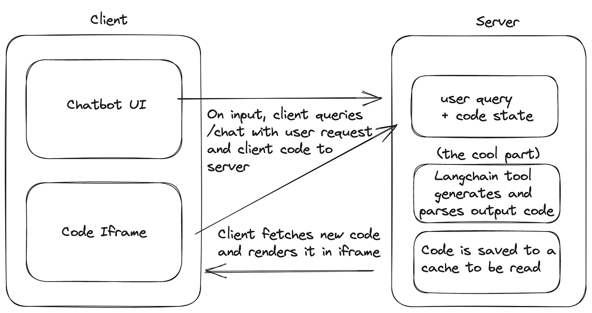

# ui-chat

)

UI-Chat is a chatbot that generates user interface code based on conversational inputs. This means you can simply describe the interface you want, and the chatbot will generate and preview the corresponding HTML, CSS, and JavaScript code.

Ui-chat is build with react.js, node.js, langchain.js for the LLM actions, and hosted on Azure. You can see the hosted demo here:
https://uichat.azurewebsites.net/

## Demo

https://github.com/aditya-pethe/ui-chat/assets/50645024/b1a52979-f870-4716-824c-0cc6ee7cc53f

## Usage Tips

- The more specific you can be while prompting, the closer you will get to desired outputs
- Sometimes generations might output incorrectly, and not be parsed properly as a result - check the code if it looks way off
- One fun prompt idea is "imitation" websites - i.e "Create an imitation website of Google" and so on. 
- Right now this is a fun tool for idea generation, and not best for writing usable / extensible code
- Currently, response times can take up to 2 minutes - working on reducing that is probably most important for usability

## How it works

Under the hood, UI-chat uses gpt-4 to generate code based on user requests, and previews it in the browser. Basically, uichat takes in the client code state + user request, and generates modified code. It does this using langchain, an open source library for building applications with large language models.  

Here's a very basic system design:

<!-- 
 -->

## Todo Features

- [X] open ai key functionality (can now be activated)
- [ ] copy-paste on iframes
- [ ] experiment with writing diffs instead of code
- [ ] fine tuning experiment for better generations
- [ ] accounts / save states for users
